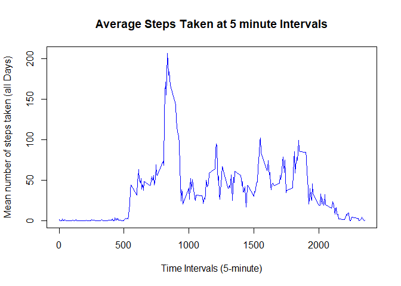
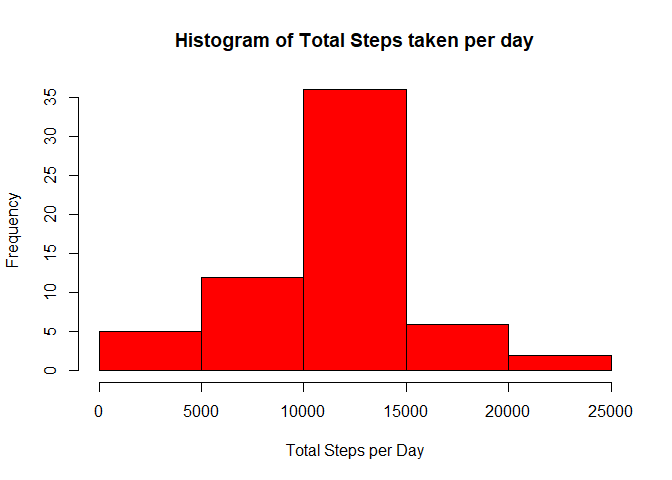
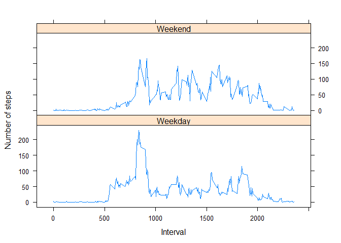

# Reproducible Research: Peer Assessment 1

```r
library(lattice)
```
## Loading and preprocessing the data
Load csv data **activity.csv** and convert dates to **R Date class**  

```r
actdata <- read.csv("activity.csv")
actdata$date <- as.Date(actdata$date,"%Y-%m-%d")
head(actdata)
```

```
##   steps       date interval
## 1    NA 2012-10-01        0
## 2    NA 2012-10-01        5
## 3    NA 2012-10-01       10
## 4    NA 2012-10-01       15
## 5    NA 2012-10-01       20
## 6    NA 2012-10-01       25
```

## What is mean total number of steps taken per day?
1. Split data by day (date) and calculate steps in each one.
2. Plot the histogamme.
3. Calculate mean and medaine.


Compute total number of steps per day  

```r
totsteps <- tapply(actdata$steps, actdata$date,sum)
```
Plot histogram of **total number of steps per day**

```r
hist(totsteps,col="blue",xlab="Total Steps per Day", 
      ylab="Frequency", main="Histogram of Total Steps taken per day")
```

<!-- -->
Compute Mean total steps taken per day

```r
mean(totsteps,na.rm=TRUE)
```

```
## [1] 10766.19
```

Compute Median total steps taken per day

```r
median(totsteps,na.rm=TRUE)
```

```
## [1] 10765
```

## What is the average daily activity pattern?
1. Split data by intervals.
2. Calculate average of steps in each 5 minutes interval.
3. Plot 5-minute interval (x-axis) and the average number of steps taken, averaged across all days (y-axis).
4. Find the interval that contain maximum number of steps. 


Compute mean of steps over all days by time interval

```r
meansteps <- tapply(actdata$steps,actdata$interval,
                                 mean,na.rm=TRUE)
```
Timeseries plot of of the 5-minute interval and the average number of steps taken, averaged across all days

```r
plot(row.names(meansteps),meansteps,type="l",
     xlab="Time Intervals (5-minute)", 
     ylab="Mean number of steps taken (all Days)", 
     main="Average Steps Taken at 5 minute Intervals",
     col="blue")
```

<!-- -->
Find the time interval that contains maximum average number of steps over all days

```r
interval_num <- which.max(meansteps)
interval_max_steps <- names(interval_num)
interval_max_steps
```

```
## [1] "835"
```
The ** 835** minute  or ** 104th ** 5 minute interval contains the maximum number of steps on average across all the days


## Imputing missing values

1. Calculate and report the total number of missing values in the dataset.
2. Devise a strategy for filling in all of the missing values in the dataset.
3. Create a new dataset that is equal to the original dataset but with the missing data filled
4. Make a histogram of the total number of steps taken each day and Calculate and report the mean and median total number of steps taken per day. 


Compute the number of NA values in the activity dataset

```r
num_na_values <- sum(is.na(actdata))
num_na_values 
```

```
## [1] 2304
```

Fill in missing values using the **average interval value across all days**

```r
na_indices <-  which(is.na(actdata))
imputed_values <- meansteps[as.character(actdata[na_indices,3])]
names(imputed_values) <- na_indices
for (i in na_indices) {
    actdata$steps[i] = imputed_values[as.character(i)]
}
sum(is.na(actdata)) 
```

```
## [1] 0
```

```r
totsteps <- tapply(actdata$steps, actdata$date,sum)
hist(totsteps,col="red",xlab="Total Steps per Day", 
      ylab="Frequency", main="Histogram of Total Steps taken per day")
```

<!-- -->


## Are there differences in activity patterns between weekdays and weekends?
1. Create a new factor variable in the dataset with two levels - "weekday" and "weekend" indicating whether a given date is a weekday or weekend day.
2. Make a panel plot containing a time series plot (i.e. type = "l") of the 5-minute interval (x-axis) and the average number of steps taken, averaged across all weekday days or weekend days (y-axis).


```r
days <- weekdays(actdata$date)
actdata$day_type <- ifelse(days == "Saturday" | days == "Sunday", 
                                "Weekend", "Weekday")
meansteps <- aggregate(actdata$steps,
                                    by=list(actdata$interval,
                                            actdata$day_type),mean)
names(meansteps) <- c("interval","day_type","steps")
xyplot(steps~interval | day_type, meansteps,type="l",
       layout=c(1,2),xlab="Interval",ylab = "Number of steps")
```

<!-- -->
Let's compute the mean, median, max and min of the steps across all intervals and days by Weekdays/Weekends

```r
tapply(meansteps$steps,meansteps$day_type,
       function (x) { c(MINIMUM=min(x),MEAN=mean(x),
                        MEDIAN=median(x),MAXIMUM=max(x))})
```

```
## $Weekday
##   MINIMUM      MEAN    MEDIAN   MAXIMUM 
##   0.00000  35.61058  25.80314 230.37820 
## 
## $Weekend
##   MINIMUM      MEAN    MEDIAN   MAXIMUM 
##   0.00000  42.36640  32.33962 166.63915
```
